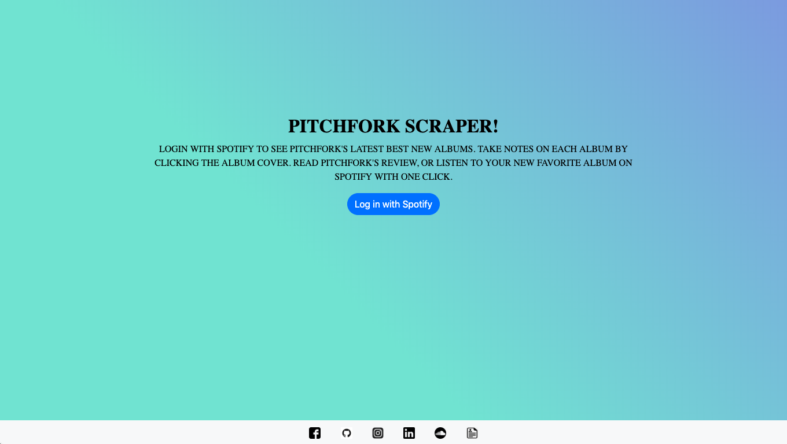
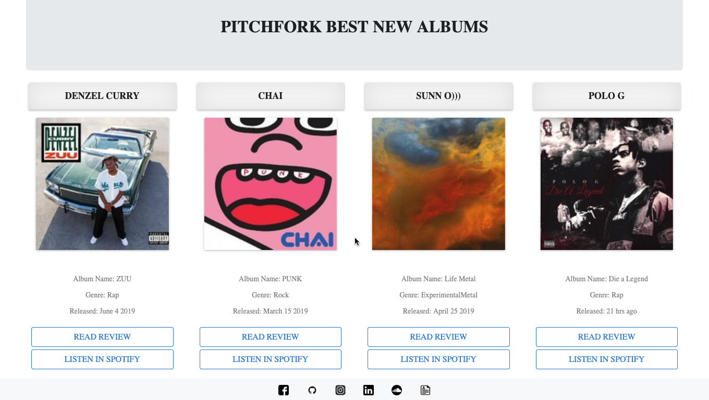
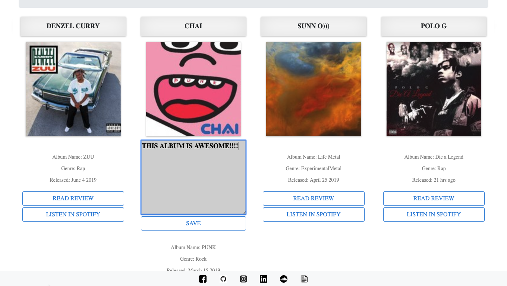
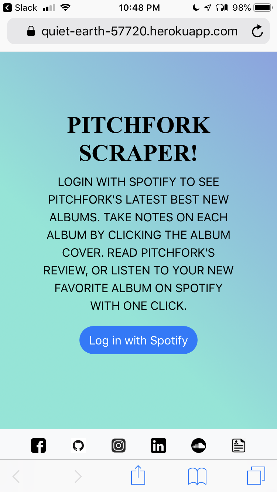
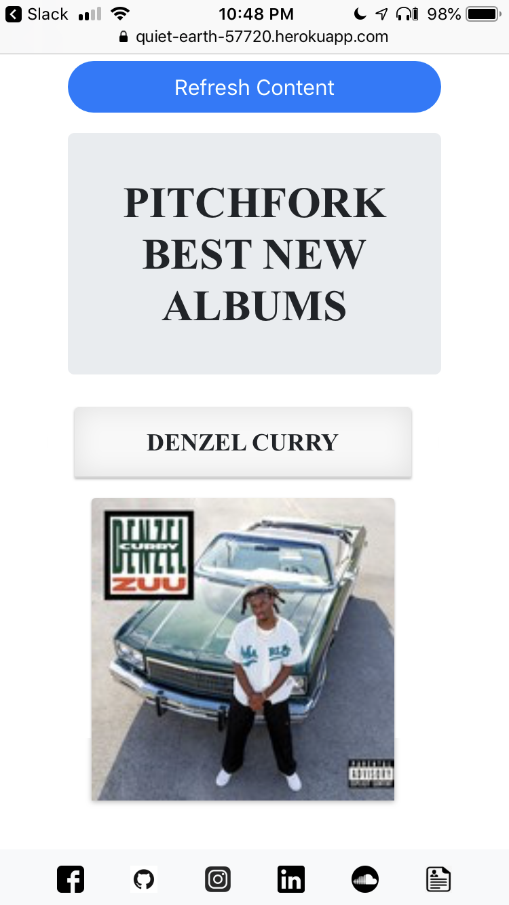
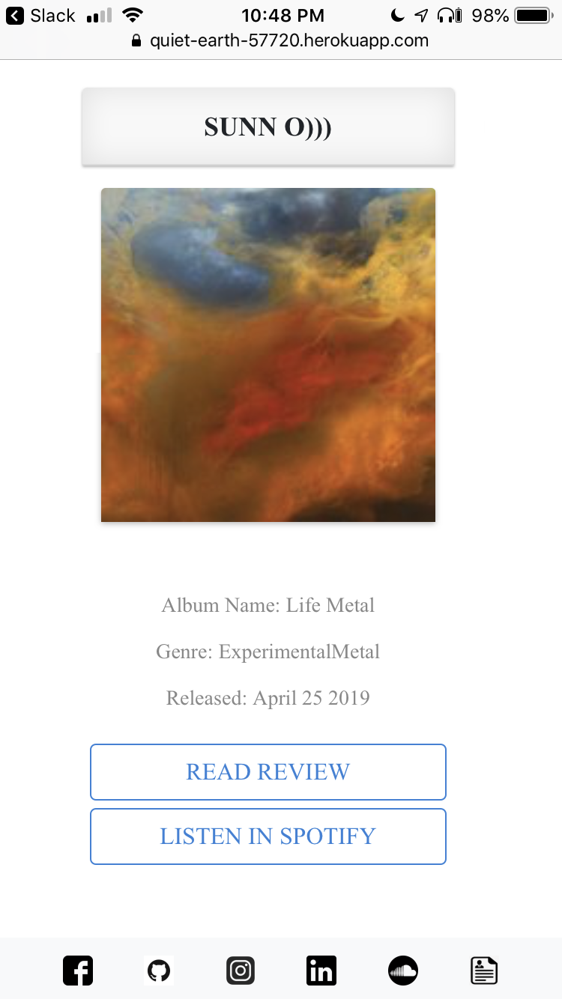
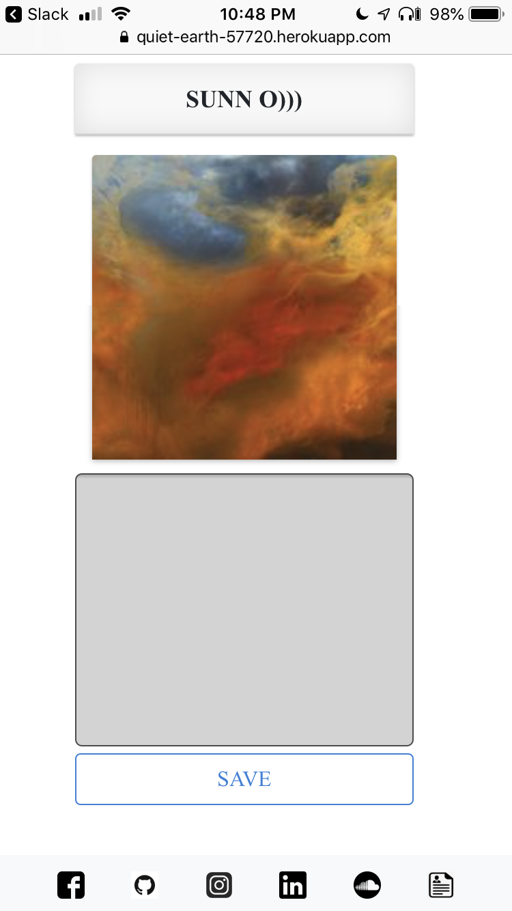

# Pitch Fork Scraper - Manage Your Favorite Albums Of The Month

An app that scrapes Pitchfork's Best Albums page and provides the user access to the review link, a note taking feature, and the ability to open the album in spotify with one click. I built this because the Pitchfork Best Albums page does not have a link to the spotify URI of each album, and I wanted easier access to new music. 

## Getting Started

Log in to your spotify account, and click the refresh button to see if there are any new albums to check out. Click the album cover to take notes on the album, then click 'save' to save and close the note. Click 'read review' to read the review, or 'listen in spotify' to listen to the album in your spotify app.   

## Deployment

This app was deployed using heroku and mLab MongoDB.
https://quiet-earth-57720.herokuapp.com/

## Built With

* [Bootstrap](https://getbootstrap.com/docs/4.3/getting-started/introduction/)
* [jQuery](https://api.jquery.com/)
* [Node.js](https://nodejs.org/en/docs/)
* [Express.js](https://expressjs.com/en/starter/installing.html)
* [MongoDB](https://docs.mongodb.com/?_ga=2.20460024.197898581.1560393738-1763429748.1559843514)
* [Mongoose](https://mongoosejs.com/docs/guide.html)
* [Cheerio](https://cheerio.js.org/)
* [Axios](https://www.npmjs.com/package/axios)

## Authors

* **Alex Eversbusch** 

## Version

V1.0

## Screenshots
## Log In

## Albums Page Desktop

## Note Taking 

## Mobile Log In

## Mobile Albums Page

## Mobile Albums Page

## Mobile Notes Page 

